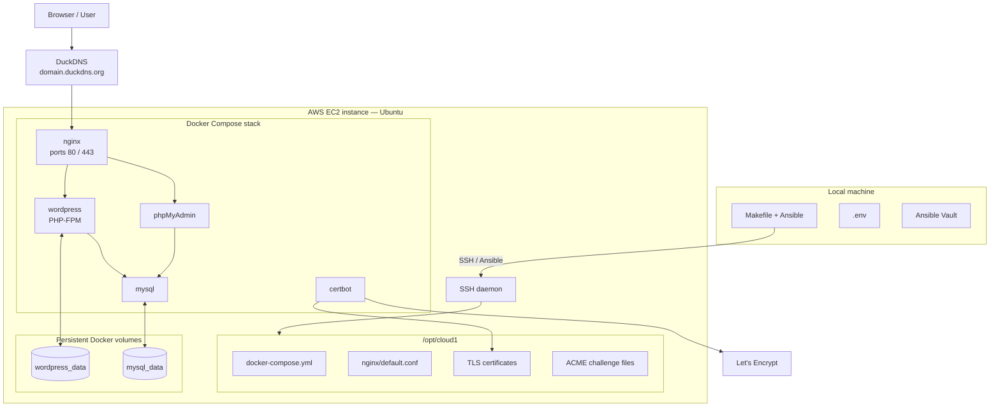

# Cloud-1 — WordPress Deployment

This project deploys a WordPress website on an Ubuntu EC2 instance using:

- Ansible for provisioning
- Docker Compose for containers
- Nginx as reverse proxy
- WordPress + PHP-FPM
- MySQL
- phpMyAdmin
- Let’s Encrypt HTTPS
- DuckDNS
- Ansible Vault for secrets

The Ansible code is split into focused roles instead of one large monolithic role.

---

## Runtime architecture



---

## Repository structure

```text
cloud-1/
├── ansible.cfg
├── requirements.yml
├── site.yml
├── Makefile
├── .env.example
├── README.md
│
├── inventory/
│   └── hosts.ini.example
│
├── host_vars/
│   └── wp1.yml.example
│
├── group_vars/
│   ├── all.yml
│   ├── generated.yml.example
│   └── vault.yml.example
│
├── secrets/
│   └── encrypted .vault
│
├── scripts/
│   ├── apply-env.sh
│
└── roles/
    ├── common/
    ├── docker/
    ├── cloud1_layout/
    ├── secrets/
    ├── mysql/
    ├── wordpress/
    ├── phpmyadmin/
    ├── duckdns/
    ├── nginx/
    ├── compose/
    ├── certbot/
    └── summary/
```

---

## Role responsibilities

| Role | Responsibility |
|---|---|
| `common` | Validate required variables and install baseline packages. |
| `docker` | Install Docker Engine and Docker Compose v2. |
| `cloud1_layout` | Create `/opt/cloud1` directory layout. |
| `secrets` | Write Docker secret files from Ansible Vault values. |
| `mysql` | Deploy MySQL Dockerfile and configuration. |
| `wordpress` | Deploy WordPress Dockerfile and PHP upload configuration. |
| `phpmyadmin` | Deploy phpMyAdmin Dockerfile. |
| `duckdns` | Update DuckDNS A record. |
| `nginx` | Deploy Nginx Dockerfile and initial HTTP/HTTPS config. |
| `compose` | Render Docker Compose and start/recreate the stack. |
| `certbot` | Obtain/renew Let's Encrypt certificates and reload Nginx. |
| `summary` | Display final deployment URLs. |

---

## Secrets

Create the real vault file:

```bash
cp group_vars/vault.yml.example group_vars/vault.yml
nano group_vars/vault.yml
ansible-vault encrypt group_vars/vault.yml
```

It must contain:

```yaml
vault_db_password: "..."
vault_db_root_password: "..."
vault_duckdns_token: "..."
```

The encrypted file must start with:

```text
$ANSIBLE_VAULT;1.1;AES256
```

For the SSH key, either keep your private key locally at:

```text
~/.ssh/cloud1-aws.pem
```

or store an encrypted copy as:

```text
secrets/cloud1-aws.pem.vault
```

Then restore it with:

```bash
make restore-key
```

Never commit secrets in clear text.

---

## First setup on a new machine

```bash
git clone <REPOSITORY_URL>
cd cloud-1

make setup
source .venv/bin/activate

cp .env.example .env
nano .env
```

Then:

```bash
make restore-key      # only if secrets/cloud1-aws.pem.vault exists
make apply-env
make inventory
make ping
make syntax
make deploy
```

If you already have the private key locally at `~/.ssh/cloud1-aws.pem`, you can skip `make restore-key`.

---

## Normal redeployment

```bash
cd cloud-1
source .venv/bin/activate
make apply-env
make ping
make syntax
make deploy
```

---

## Useful Make commands

```bash
make help          # show available commands
make setup         # create venv and install Ansible dependencies
make restore-key   # decrypt SSH key into ~/.ssh/cloud1-aws.pem
make apply-env     # generate inventory and local vars from .env
make inventory     # show Ansible inventory
make ping          # test Ansible SSH connection
make syntax        # run Ansible syntax check
make deploy        # run the Ansible deployment
make ssh           # connect to the EC2 instance
make clean-local   # remove generated local files
```

---

## Multi-server note

Ansible can deploy this stack to several hosts by adding several entries under:

```ini
[wordpress_servers]
wp1 ansible_host=203.0.113.10
wp2 ansible_host=203.0.113.11
```

However, this does not create one shared WordPress site. It creates one independent stack per server, each with its own local MySQL and local Docker volumes.

A real shared multi-server WordPress deployment would require:

```text
load balancer
+ several web nodes
+ shared database
+ shared media/uploads storage
```

This refactor improves maintainability without changing the current single-server architecture.

---

## Manual checks on the server

```bash
make ssh
cd /opt/cloud1
sudo docker compose ps
sudo docker compose logs --tail=100 nginx
sudo docker compose logs --tail=100 wordpress
sudo docker compose logs --tail=100 mysql
sudo docker volume ls
```

---

## Website checks

```bash
curl -I https://<YOUR_DOMAIN>
curl https://<YOUR_DOMAIN>/healthz
```

Browser URLs:

```text
https://<YOUR_DOMAIN>/
https://<YOUR_DOMAIN>/wp-admin/
https://<YOUR_DOMAIN>/phpmyadmin/
```

phpMyAdmin access is restricted by:

```env
PHPMYADMIN_ALLOWED_CIDR=YOUR_PUBLIC_IP/32
```

After changing it:

```bash
make apply-env
make deploy
```

---

## AWS cleanup

At the end of the project, review and delete unused resources:

```text
EC2 instance
Elastic IP
EBS volume
Security groups
Key pairs
```

## REMINDER FOR MYSELF:
- my domain: lrandria-cloud1-wp1(.duckdns.org)
- my elastic IP: 16.192.70.128
- change IP to current IP onto the console to connect by ssh
- change PHPMYADMIN IP, but if I do, I need to restart Nginx container.
