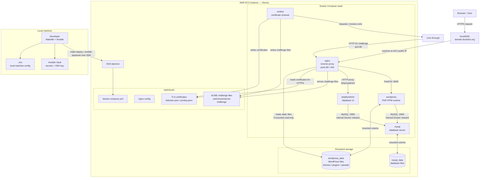

# Cloud-1 — WordPress Deployment

This project deploys a WordPress website on an Ubuntu EC2 instance using:

- Ansible for provisioning
- Docker Compose for containers
- Nginx as reverse proxy
- WordPress + PHP-FPM
- MySQL
- phpMyAdmin
- Let’s Encrypt HTTPS
- DuckDNS
- Ansible Vault for secrets

---

## Runtime architecture



### Component communication

- The local machine runs Ansible through the Makefile.
- Ansible connects to the EC2 instance over SSH and deploys files into `/opt/cloud1`.
- Docker Compose starts the application containers.
- DuckDNS points the public domain to the EC2 public IP.
- Nginx is the only public web entrypoint on ports 80 and 443.
- Nginx forwards WordPress PHP requests to the WordPress PHP-FPM container.
- Nginx forwards `/phpmyadmin/` requests to the phpMyAdmin container.
- WordPress and phpMyAdmin both connect to MySQL over the internal Docker network.
- MySQL is not publicly exposed.
- Certbot obtains and renews HTTPS certificates through Let's Encrypt.
- Certbot writes certificate files, and Nginx reads them to serve HTTPS.
- WordPress files and MySQL database files are stored in persistent Docker volumes.

## Repository structure

```text
cloud-1/
├── ansible.cfg
├── requirements.yml
├── site.yml
├── Makefile
├── .env.example
├── README.md
│
├── inventory/
│   └── hosts.ini.example
│
├── host_vars/
│   └── wp1.yml.example
│
├── group_vars/
│   ├── all.yml
│   ├── generated.yml.example
│   └── vault.yml
│
├── secrets/
│   └── cloud1-aws.pem.vault
│
├── scripts/
│   └── apply-env.sh
│
└── roles/
    └── cloud1/
        ├── tasks/
        ├── templates/
        └── files/
```

---

## Secrets

Secrets are managed with Ansible Vault.

The encrypted file:

```text
group_vars/vault.yml
```

contains:

```yaml
vault_db_password: "..."
vault_db_root_password: "..."
vault_duckdns_token: "..."
```

The encrypted file:

```text
secrets/cloud1-aws.pem.vault
```

contains the AWS SSH private key.

Both encrypted files must start with:

```text
$ANSIBLE_VAULT;1.1;AES256
```

Never commit secrets in clear text.

---

## Local files not committed

These files are local or generated:

```text
.env
.venv/
inventory/hosts.ini
host_vars/wp1.yml
group_vars/generated.yml
*.pem
*.retry
```

They are ignored by Git.

---

## First setup on a new machine

Clone the project:

```bash
git clone <REPOSITORY_URL>
cd cloud-1
```

Install the local Python / Ansible environment:

```bash
make setup
```

Create the local `.env` file:

```bash
cp .env.example .env
nano .env
```

Example:

```env
AWS_HOST_ALIAS=wp1
AWS_ELASTIC_IP=YOUR_ELASTIC_IP
ANSIBLE_USER=ubuntu
SSH_KEY_PATH=~/.ssh/cloud1-aws.pem

CLOUD1_PROJECT_DIR=/opt/cloud1

DUCKDNS_SUBDOMAIN=your-duckdns-subdomain
ENABLE_DUCKDNS=true

ENABLE_TLS=true
LETSENCRYPT_EMAIL=your-email@example.com
LETSENCRYPT_STAGING=false

PHPMYADMIN_ALLOWED_CIDR=YOUR_PUBLIC_IP/32
```

Restore the SSH key from Ansible Vault:

```bash
make restore-key
```

Generate local Ansible files:

```bash
make apply-env
```

Check that Ansible can reach the server:

```bash
make check
```

Deploy or redeploy:

```bash
make deploy
```

---

## Normal redeployment

```bash
cd cloud-1
make apply-env
make check
make deploy
```

---

## Useful Make commands

```bash
make help          # show available commands
make setup         # create venv and install Ansible dependencies
make restore-key   # decrypt SSH key into ~/.ssh/cloud1-aws.pem
make apply-env     # generate inventory and local vars from .env
make inventory     # show Ansible inventory
make ping          # test Ansible SSH connection
make syntax        # run Ansible syntax check
make check         # apply-env + inventory + ping + syntax
make deploy        # run the Ansible deployment
make ssh           # connect to the EC2 instance
make clean-local   # remove generated local files
```

The Makefile is only a shortcut layer. The actual deployment logic remains in Ansible.

---

## Manual commands on the server

SSH into the instance:

```bash
make ssh
```

Go to the deployment directory:

```bash
cd /opt/cloud1
```

Check containers:

```bash
sudo docker compose ps
```

Restart all containers:

```bash
sudo docker compose restart
```

Restart one container:

```bash
sudo docker compose restart nginx
sudo docker compose restart wordpress
sudo docker compose restart mysql
sudo docker compose restart phpmyadmin
```

View logs:

```bash
sudo docker compose logs --tail=100 nginx
sudo docker compose logs --tail=100 wordpress
sudo docker compose logs --tail=100 mysql
```

View volumes:

```bash
sudo docker volume ls
sudo docker volume inspect cloud1_mysql_data
sudo docker volume inspect cloud1_wordpress_data
```

---

## Website checks

```bash
curl -I https://<YOUR_DOMAIN>
curl https://<YOUR_DOMAIN>/healthz
```

Browser URLs:

```text
https://<YOUR_DOMAIN>/
https://<YOUR_DOMAIN>/wp-admin/
https://<YOUR_DOMAIN>/phpmyadmin/
```

phpMyAdmin access is restricted by:

```env
PHPMYADMIN_ALLOWED_CIDR=YOUR_PUBLIC_IP/32
```

After changing it:

```bash
make apply-env
make deploy
```

---

## Security model

Public ports:

```text
80
443
```

The database is not publicly exposed.

MySQL is reachable only inside the Docker network by:

```text
wordpress
phpmyadmin
```

Secrets are encrypted with Ansible Vault and are not stored in clear text.

---

## Idempotency

The deployment can be run multiple times:

```bash
make deploy
make deploy
```

Expected result:

```text
failed=0
site still works
data persists
```

---

## Redeploying the same site

To redeploy the same existing site, keep the same:

```text
AWS_ELASTIC_IP
DUCKDNS_SUBDOMAIN
group_vars/vault.yml
Ansible Vault password
SSH private key
```

The WordPress data remains the same as long as the same EC2 instance and Docker volumes are used.

---

## AWS cleanup

At the end of the project, review and delete unused resources:

```text
EC2 instance
Elastic IP
EBS volume
Security groups
Key pairs
```